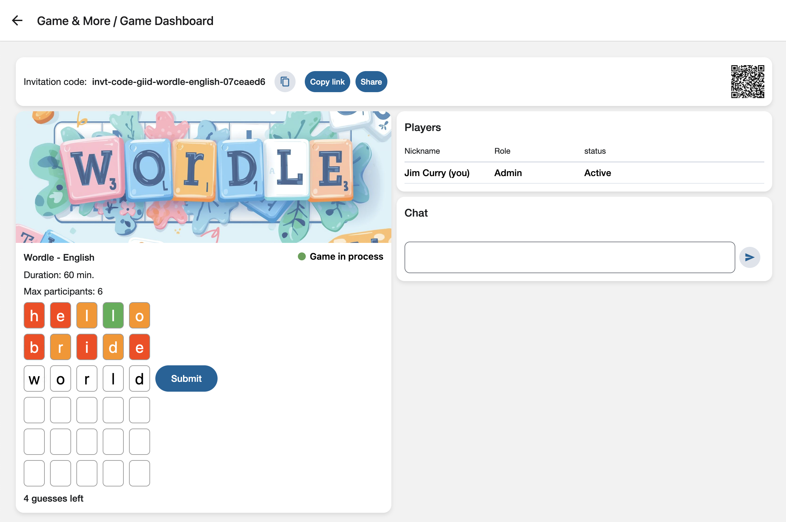

## Games & More

**Games & More** is a platform that provides interactive, multi-player, fun games.

---

### How to run locally

- You need a running redis on port 6379. If you don't have one:
  - If you don't have docker installed:
    - On **Mac**: `brew install docker`
  - `npm run start:redis`
- `npm install`
- `npm start`
- Go to: http://localhost

---

### Monorepo Structure

This **monorepo** was designed to host multiple applications and shared packages in a single repository.

The repository is organized as follows:

- **`apps/`** and  **`python/apps/`**: Contains minimal applications, each using packages provided in the `packages/` folder.
- **`packages/`** and  **`python/packages/`**: Contains all the plugins required for the app, as well as shared code and utilities.
- **`apps/ig-api`**: Backend **Express** app, serves GraphQL queries.
  - This is a minimal package. It uses a library module to initialize Express, connect to the DB, and setup the plugins.
- **`python/apps/ig-ws`**: Backend websocket server, notifying connected clients when there are updates.
  - Reads messages that are published to Redis, and relays the information to the relevant clients.
- **`apps/ig-expo`**: Client **Expo** app, used both for web and mobile.
  - This package only contains the routes and assets. The actual components are provided by UI plugins (in `packages/`).

---

### Technologies Used

#### Frontend

- UI
  - **React Native**: For building cross-platform mobile interfaces.
  - **Expo**: A framework that simplifies building, running, and deploying React Native apps on mobile and web.
  - **Next.js**: A framework for building static SSR (server-side rendering) web applications with built-in routing and performance optimizations.
  - **React Native Paper**: Material Design components for React Native. Components are wrapped inside a local package, `@ig/rnui`,
  providing consistent styling and additional custom behavior.

- State Management
  - **Redux**: Centralized state management for predictable app state.
  - **RTK Query**: API fetching and caching with automatic invalidation.
    - Handles dynamic tags for selective refetching.
    - Integrates seamlessly with Redux.

- Real-Time Client Updates
  - **WebSockets**: Notify clients in real-time when relevant data updates occur, enabling live client updates.

- Localization / Internationalization
  - **i18next**: A framework that adapts the UI to different languages, regions, and cultural conventions.

---

#### Backend

- DB
  - **Mongo DB**: A no-sql database.
    - **mongoose**: A Node.js client to access the DB.
    - **mongodb-memory-server**: An in-memory Node.js Mongo DB instance for rapid development and testing.

- API Server
  - **Express**: A Node.js web framework for serving HTTP requests using middlewares and routing.
  - **GraphQL**: A query language and runtime for APIs, where clients request exactly the data they need from a strongly typed schema.
  - **Apollo Server**: A GraphQL server to serve the schemas and connect them with resolvers.

- Message Broker
  - **Redis**: An in-memory data store used as a message broker, known for extremely fast reads and writes.

- WebSocket Server
  - Python **websockets**: A set of libraries that let Python applications open persistent, two-way, real-time communication channels over WebSocket connections.
  - Python **redis**: A **Redis** client utility.

- Authentication
  - JWT is used to set an authenticaion cookie token for each client.

---

#### Testing and CI/CD

- Testing: Node
  - **Vitest**: A modern test environment with advanced TypeScript features, also supporting coverage (via **istanbul**).
  - **Jest** and **React Testing Library**: Widely used pair for React Native testing and coverage (via **istanbul**).
  - **Eslint**: With presets for react-native/expo.
  - **Madge**: A tool used to ascertain no circular dependencies exist.
  - **NYC**: A tool used to create an HTML coverage report for the entire project.

- Testing: Python
  - **poetry**: Python package management.
  - **pytest**: A python testing tool.
  - **mypy** and **ruff**: Python tools used to type-check, lint, and format.
  - **make** and **Makefile**: A build automation tool that reads a Makefile to determine how to run a set of commands.

- CI/CD
  - **Husky**: A tool to control git hooks in teams.
  - **GitHub Actions**: A CI/CD platform that automates workflows like building, testing, and deploying code directly from a GitHub repository.

---

### Architecture

This repository was created with a few design paradigms in mind:

#### Frontend Design: Feature/Domain

The client code uses a primary **feature/domain** design, where code responsible for UI features is separated from code responsible for accessing API.
- The **features** strictly contain UI components with no logic whatsoever.
- The **domains** use RTK queries to access the API and provide an abstraction layer to the **features** layer. The **domains** also provide **websocket handlers** to handle messages sent from the server.

#### API Backend Design: Express => GraphQL => Business Logic => DB Adapter => MongoDB

The API backend is built in 3 logical layers:
- The **Query** layer:
  - The main **/graphql** API endpoint is mounted on an Express router, for which an Apollo Server middleware is provided. This middleware connects the HTTP requests with the GraphQL schema.
  - The schema is connected with the business logic layer using resolvers.
  - Authorization is enforced, using GraphQL directives.
  - This layer recieves a database adapter instance, and pass it on to the business logic layer. Replacing the database is as passing another database adapter at this point (and, implementing that adapter for the new database).
- The **Business Logic** layer:
  - Recieves raw HTTP data.
  - Retrieves data from the database adapter layer if necessary.
  - Makes validation.
  - Makes updates through the database adapter.
  - Returns a result.
- The **Database Adapter** layer:
  - The backend is built so that the database is completely isolated from the business logic.
  - A database adapter presents the business logic layer with an interface to the database, hiding both the database operations, as well as the database itself.
  - Database adapters can use whatever database provider they want (MongoDB / MySQL / PostgreSQL).

